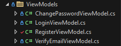

# Asp.Net-Core-Authentication
Login and registration using the built-in ASP.NET Core Identity for authentication and authorization.
   
<br>        
 
### 1. Create a model class inside the Models folder.
```csharp

using Microsoft.AspNetCore.Identity;

namespace Asp.NetCore_Identity_Auth.Models
{
    public class Users : IdentityUser
    {
       public string Fullname { get; set; }
    }
}

```

Note: The Fullname is not part of the identity properties; it is only added if you want to include additional data in your Register Account Form or Database

<br>
<br>

### 2. Create a new folder in your project and name it whatever you prefer, but in our case, we named it 'Database'. This is the folder where we will place the DbContext Class.


```csharp
using Asp.NetCore_Identity_Auth.Models;
using Microsoft.AspNetCore.Identity.EntityFrameworkCore;
using Microsoft.EntityFrameworkCore;
namespace Asp.NetCore_Identity_Auth.Database
{
    public class _DbContext : IdentityDbContext<Users>
    {
        public _DbContext(DbContextOptions options) : base(options) { }
    }
}

```


<br>
<br>


### 3. Register the required Identity authentication configurations, DbContext setup, and necessary middleware inside the Program.cs file.

Here is the code for the DbContext Set up.

```csharp
builder.Services.AddDbContext<_DbContext>(options => options.UseSqlServer(builder.Configuration.GetConnectionString("database")));
```

<br>

Here is the code for the Identity Auth configuration.

```csharp
builder.Services.AddIdentity<Users, IdentityRole>(option =>
{
    option.Password.RequireDigit = false;
    option.Password.RequireLowercase = false;
    option.Password.RequireUppercase = false;
    option.Password.RequireNonAlphanumeric = false;
    option.Password.RequiredLength = 3;

    option.User.RequireUniqueEmail = true; 
    option.SignIn.RequireConfirmedEmail = false;

})
    .AddEntityFrameworkStores<_DbContext>()
    .AddDefaultTokenProviders();  
```

<br>

Here is the code for Identity Auth Middleware.

```csharp
app.UseAuthentication();
app.UseAuthorization();
```

<br>

### Overall Program.cs file set up

```csharp
using Asp.NetCore_Identity_Auth.Database;
using Asp.NetCore_Identity_Auth.Models;
using Microsoft.AspNetCore.Identity;
using Microsoft.EntityFrameworkCore;


var builder = WebApplication.CreateBuilder(args);

//for MVC registration
builder.Services.AddControllersWithViews();

//for DbContext Configuration
builder.Services.AddDbContext<_DbContext>(options => options.UseSqlServer(builder.Configuration.GetConnectionString("database")));

//Setup for Identity Auth configuration
builder.Services.AddIdentity<Users, IdentityRole>(option =>
{
    option.Password.RequireDigit = false;
    option.Password.RequireLowercase = false;
    option.Password.RequireUppercase = false;
    option.Password.RequireNonAlphanumeric = false;
    option.Password.RequiredLength = 3;

    option.User.RequireUniqueEmail = true; 
    option.SignIn.RequireConfirmedEmail = false;

})
    .AddEntityFrameworkStores<_DbContext>()
    .AddDefaultTokenProviders();    


var app = builder.Build();


if (!app.Environment.IsDevelopment())
{
    app.UseExceptionHandler("/Error");
    app.UseHsts();
}

app.UseHttpsRedirection();
app.UseStaticFiles();

app.UseRouting();
app.UseAuthentication();
app.UseAuthorization();


app.MapControllerRoute(
    name:"default",
    pattern: "{controller=Account}/{action=login}/{id?}"
);


app.Run();

```

<br>
<br>

### 4. Create a new folder in your project and name it ViewModels, although you can name it anything you prefer. In this case, we’re following the proper naming convention used in the industry. Inside this folder, we will place the model class that will be used for Login, Register, Change Password, and so on.


Here is the code for the LoginViewModel.cs.

```csharp
using System.ComponentModel.DataAnnotations;

namespace Asp.NetCore_Identity_Auth.ViewModels
{
    public class LoginViewModel
    {
        [Required(ErrorMessage ="Email is required.")]
        public string Email { get; set; }


        [Required(ErrorMessage = "Password is required.")]
        [DataType(DataType.Password)]
        public string Password { get; set; }


        [Display(Name = "Remember me?")]
        public bool RememberMe { get; set; }   

    } 
}

```

<br>

Here is the code for the RegisterViewModel.cs.

```csharp
using System.ComponentModel.DataAnnotations;

namespace Asp.NetCore_Identity_Auth.ViewModels
{
    public class RegisterViewModel
    {
        [Required(ErrorMessage = "Name is required")]
        public string Name { get; set; }


        [Required(ErrorMessage = "Email is required")]
        [EmailAddress]
        public string Email { get; set; }


        [Required(ErrorMessage = "Password is required")]
        [StringLength(40, MinimumLength = 3, ErrorMessage = "The {0} must be at {2} and at max {1} characters" )]
        [DataType(DataType.Password)]//this code is for masking textbox for password
        [Compare("ConfirmPassword", ErrorMessage = "Password does not match.")]
        public string Password { get; set; }


        [Required(ErrorMessage = "Confirm Password is required")]
        [DataType(DataType.Password)]//this code is for masking textbox for password
        public string ConfirmPassword { get; set; }

    }
}


```


<br>


Here is the code for the VerifyEmailViewModel.cs

```csharp
using System.ComponentModel.DataAnnotations;

namespace Asp.NetCore_Identity_Auth.ViewModels
{
    public class VerifyEmailViewModel
    {
        [Required(ErrorMessage = "Email is required")]
        [EmailAddress]
        public string Email { get; set; }
    }
}

```

<br>


Here is the code for the ChangePasswordViewModel.cs

```csharp
using System.ComponentModel.DataAnnotations;

namespace Asp.NetCore_Identity_Auth.ViewModels
{
    public class ChangePasswordViewModel
    {
        [Required(ErrorMessage = "Email is required")]
        [EmailAddress]
        public string Email { get; set; }


        [Required(ErrorMessage = "NewPassword is required")]
        [StringLength(40, MinimumLength = 3, ErrorMessage = "The {0} must be at {2} and at max {1} characters")]
        [DataType(DataType.Password)]
        [Compare("ConfirmNewPassword", ErrorMessage = "NewPassword does not match.")]
        [Display(Name = "New Password")]
        public string NewPassword { get; set; }


        [Required(ErrorMessage = "Confirm NewPassword is required")]
        [DataType(DataType.Password)]
        [Display(Name = "Confirm Password")]
        public string ConfirmNewPassword { get; set; }
    }
}


```


<br>
<br>


### 5. Add migration and update database Go to Tools, then find NuGet Package Manager, and open the NuGet Package Console. From there, you can run the migration and update the database
```markdown
add-migration

update-database
```

<br>
<br>


### 6. Create Razor Pages for the UI, and just repeat this process for our other features.
```cshtml
@model ChangePasswordViewModel


<form asp-controller="Account" asp-action="Trying_ChangePassword" method="post">

    <label asp-for="Email"></label><br>
    <input asp-for="Email" /><br>

    <label asp-for="NewPassword"></label><br>
    <input asp-for="NewPassword" /><br>

    <label asp-for="ConfirmNewPassword"></label><br>
    <input asp-for="ConfirmNewPassword" /><br>

    <input type="submit" value="ChangePassword" />
   

</form>
```


<br>
<br>


### 7. Create a controller that will contain all the logic and functionality for handling login, authentication, and authorization.


```csharp
using Asp.NetCore_Identity_Auth.Database;
using Asp.NetCore_Identity_Auth.Models;
using Asp.NetCore_Identity_Auth.ViewModels;
using Microsoft.AspNetCore.Identity;
using Microsoft.AspNetCore.Mvc;


namespace Asp.NetCore_Identity_Auth.Controllers
{
    public class AccountController : Controller
    {

        private readonly SignInManager<Users> signInManager;
        private readonly UserManager<Users> userManager;

        public AccountController(SignInManager<Users> _signInManager, UserManager<Users> _userManager)
        {
            signInManager = _signInManager;
            userManager = _userManager; 
        }

        //check if success if true user cannot back to the login page anymore
        public IActionResult login()
        {
            if (User.Identity.IsAuthenticated)
            {
                return RedirectToAction("Index", "Home");
            }
            return View();
        }

        [HttpPost]
        public async Task<IActionResult> Trying_Login(LoginViewModel model)
        {
            if (ModelState.IsValid)
            {
                var result = await signInManager.PasswordSignInAsync(model.Email, model.Password, model.RememberMe, lockoutOnFailure: false);
                if (result.Succeeded)
                {
                    return RedirectToAction("Index","Home");
                }
                else
                {
                    ModelState.AddModelError("", "Incorrect email or password");
                }
            }
            return View("login");
        }


        public IActionResult Register()
        {
            return View();
        }

        [HttpPost]
        public async Task<IActionResult> Trying_Register(RegisterViewModel model)
        {
            if (ModelState.IsValid)
            {
                Users user = new Users
                {
                    Fullname = model.Name,//ito hindi kasama sa package ng IdentityUser kaya nilagay sa User na model class
                    Email = model.Email,//ito galing sa User Model pero package siya ng IdentityUser naka inherit lang sa model Users natin kaya access
                    UserName = model.Email//ito galing sa User Model pero package siya ng IdentityUser naka inherit lang sa model Users natin kaya access
                };
                var result = await userManager.CreateAsync(user, model.Password);
                if (result.Succeeded)
                {
                    return RedirectToAction("login", "Account");
                }
                else
                {
                    foreach(var error in result.Errors)
                    {
                        ModelState.AddModelError("", error.Description);
                    }
                    return View("Register");
                }
            }
            return View("Register");
        }


        public IActionResult VerifyEmail()
        {
            return View();
        }
        [HttpPost]
        public async Task<IActionResult> Trying_VerifyEmail(VerifyEmailViewModel model)
        {
            if (ModelState.IsValid)
            {
                var user = await userManager.FindByNameAsync(model.Email);
                if(user == null)
                {
                    ModelState.AddModelError("", "Something is wrong!");
                    return View("VerifyEmail");
                }
                else
                {
                    return RedirectToAction("ChangePassword", "Account", new { username = user.UserName});
                }
            }
            return View("VerifyEmail"); 
        }


        public IActionResult ChangePassword(string username)
        {
            if (string.IsNullOrEmpty(username))
            {
                return RedirectToAction("VerifyEmail","Account");
            }
            return View( new ChangePasswordViewModel { Email = username });
        }
        [HttpPost]
        public async Task<IActionResult> Trying_ChangePassword(ChangePasswordViewModel model)
        {
            if (!ModelState.IsValid)
            {
                ModelState.AddModelError("", "Something went wrong. try again");
                return View("ChangePassword");
            }

            var user = await userManager.FindByNameAsync(model.Email);
            if (user == null)
            {
                ModelState.AddModelError("", "Email not found!");
                return View("ChangePassword");
            }

            var result = await userManager.RemovePasswordAsync(user);
            if (result.Succeeded)
            {
                result = await userManager.AddPasswordAsync(user, model.NewPassword);
                return RedirectToAction("login", "Account");
            }

            if (!result.Succeeded)
            {
                foreach (var error in result.Errors)
                {
                    ModelState.AddModelError("", error.Description);
                }
                return View("ChangePassword");
            }

            return View("ChangePassword");
        }


    }
}

```


